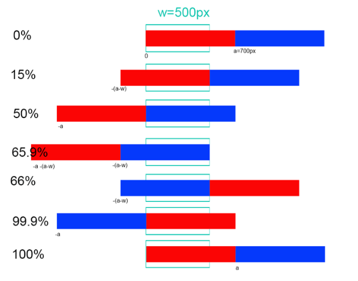

# Personal Project - Superlist Hero Recreation

This is my recreation of the hero section of [Superlist](https://www.superlist.com/), done with basic HTML, CSS and JS. I tried my best to make it as simillar as possible. 

## Table of contents

- [Overview](#overview)
  - [The challenge](#the-challenge)
  - [Screenshot](#screenshot)
- [My process](#my-process)
  - [Built with](#built-with)
  - [What I learned](#what-i-learned)
  - [Continued development](#continued-development)
- [Author](#author)
- [Acknowledgments](#acknowledgments)

**Note: Delete this note and update the table of contents based on what sections you keep.**

## Overview

### The challenge

Users should be able to:

- View the optimal layout depending on their device's screen size
- See hover states for interactive elements
- Use their cursor to change between the "dark" and "light" version

### Screenshot


## My process

### Built with

- CSS custom properties
- Flexbox
- Mobile-first workflow

### What I learned

#### Carousels
   Oh god. What. a. pain.
   This infinite autoplay carousel was the bane of my existence for the past week, trying to figure out a solution, creating that solution, seeing how janky the solution was, coming with a new solution , rinse and repeat. In the end what I got was a mere fake of the well-done carousel on the Superlist's website that looks good but far from the ideal perfection. 

   The final iteration of my carousel was constructed using pure css, keyframes. Why ? Because the iteration that I made using JS was using setInterval() to "create" the animation(more like an optical-effect). What was the problem with that ?  setInterval() doesn't work when the tab is idle and not only did I seriously disliked this behaviour but it also messed with the animation to a certain degree.

   In the end, I made it work but it was quite difficult to set everything up, especially when things like "transform: translateX() is smoother than left:_px" happens(took me a while to realize this).

   For the keyframe carousel, I used two identical divs which work simillar to this drawing :
   

   This is the CSS code for the keyframes :

```css
@keyframes moveRight_1 {
    0% {
        transform: translateX(0px);
    }

    80.99% {
        transform: translateX(calc(-1 * calc(var(--size) + calc(var(--size) - 100vw))));
    }

    81% {
        transform: translateX(100vw);
    }

    99.99% {
        transform: translateX(0px);
    }

    100% {
        transform: translateX(0px);
    }
}

@keyframes moveRight_2 {
    0% {
        transform: translateX(calc(var(--size)));
    }

    80.99% {
        transform: translateX(calc(-1 * calc(var(--size) - 100vw)));
    }

    81% {
        transform: translateX(calc(-1 * calc(var(--size) - 100vw)));
    }

    99.99999% {
        transform: translateX(calc(-1 * var(--size)));
    }

    100% {
        transform: translateX(var(--size));
    }
}
```

#### The duality (Dark and Light)
    Just like the carousel, this had more than one iteration but only one was fully accomplishing its objective.
    For this, I used two divs (the "dark" div and the "light" div), the first one having a varied width based on the cursor position and the second one being permanently at width:100%. All of this was done using JS and CSS. 

```css
main {
    overflow-x: hidden;
}

.Light {
    overflow: hidden;
    position: absolute;
    top: 0px;
    left: 0px;
    width: 100%;
    min-height: 100vh;
    background-color: var(--clr-bg-light);
    z-index: -1;
}

.Dark {
    overflow: hidden;
    position: absolute;
    top: 0px;
    left: 0px;
    width: 100%;
    min-height: 100vh;
    background-color: var(--clr-bg-dark);
    z-index: 0;
}

```

```js
const body = document.body;
const dark = document.querySelector(".Dark");
const slidingMain = document.querySelectorAll(".wrapper-sliding");
const slidingSecondary = document.querySelectorAll(".wrapper-sliding-secondary");
dark.style.width = `${window.innerWidth / 16}rem`;
body.addEventListener("mousemove", (e) => {
    let posX = e.clientX;
    dark.style.width = `${posX * 100 / window.innerWidth}%`;
});
``` 

### Future plans

Both this and hover-flashlight were interesting prejects. They have determined me even more to learn JS as in-depth as possible. Can't wait to see what it has in store for me.

## Author

- Frontend Mentor - [@GitDoppler](https://www.frontendmentor.io/profile/GitDoppler)

## Acknowledgments

[Hyperplexed](https://www.youtube.com/c/Hyperplexed)
